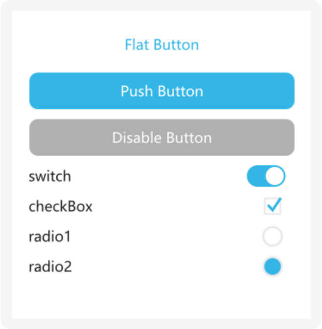

Sric/C++ cross-platform GUI library.

- Supported platforms: Windows, WebAssembly. Possible to run on Linux and MacOS but not tested.
- Support GPU or CPU render backend.

[Online Demo](https://sric.fun/wase/run.html)




## Example Code
### C++
```
#include "waseGui.h"
using namespace sric;
using namespace waseGui;

int32_t main() {
    auto frame = new_<Frame>();
    {
        auto it = new_<Button>();
        it->setText("Button");
        it->onClick = ([=](RefPtr<Widget> w) {
            Toast::showText("hello world");
            });
        frame->add(std::move(it));
    }
    frame->show();
    return 0;
}
```

### Sric
```
import waseGui::*;
fun main(): Int {
    var frame = new Frame {
        new Button {
           .setText("Button");
           .onClick = fun(w:* Widget) { Toast::showText("hello world") }
        },
    }
    frame.show()
    return 0
}
```

### HiML (XML like format)
```
waseGui::VBox
{
  style = paneBack
  padding = "50 50 50 50"
  layout = waseGui::Layout { height = 0 }
  spacing = 15

  waseGui::Label { text = Hello }

  waseGui::Button {
    id = button
    text = "Push Button"
  }
}
```


## Build

1. [Install Sric](https://sric.fun)
2. [Third-party dependencies](https://gitee.com/chunquedong/third-party)
3. Build Wase
```
sh build.sh
sh build_debug.sh
sh build_wasm.sh
```
